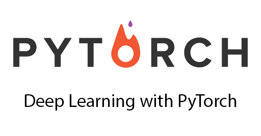

# Learning_Pytorch
 Minso Jeong, MOOC PyTorch를 활용한 딥러닝 기법
 


## Schedule
|          내용         |   날짜     |   비고   |
| -------------------------------- |:---------------:|--------------------------|
|01. Linear regression model | 2020. 09. 14 | Tensor |
|02. Logistic model, Multilayer perceptron | 2020. 09. 15 ||
|03. Fully-Connected (FC) layer| 2020. 09. 16 | Softmax, Classification model |
|04. Convolutional Neural Network (CNN) <br/>   Recurrent Neural Network (RNN) | 2020. 09. 17 | Weight initialization <br/> LSTM, GRU |
|05. | 2020. 09. 18 ||

## Setting
* anaconda 설치 (https://www.anaconda.com/products/individual)
* pycharm 설치 (https://www.jetbrains.com/ko-kr/pycharm)
* 가상환경 생성
    * Anaconda Prompt
    ```
    conda create -n 가상환경이름
    ```
* 라이브러리 설치
    * Pytorch : CUDA 10.2 기준 - (https://pytorch.org/get-started/previous-versions/)
    ```
    pip install torch==1.5.0 torchvision==0.6.0 -f https://download.pytorch.org/whl/torch_stable.html
    ```
    * package
        * numpy = 1.16.4
        * seaborn = 0.10.1
        * scikit-learn
        * pandas
        * matplotlib
        * scipy        
     
## Data
* day3 - 06.tsDataModel.py
    * weather_data.csv (https://data.kma.go.kr/stcs/grnd/grndTaList.do?pgmNo=70)
* day4 - 05.VGG16ModelEX.py
    * cat_and_dog (https://www.microsoft.com/en-us/download/details.aspx?id=54765)
        * PetImages 폴더 안 cat, dog 400장씩


## References
* Weight initialization
    * https://gomguard.tistory.com/184
